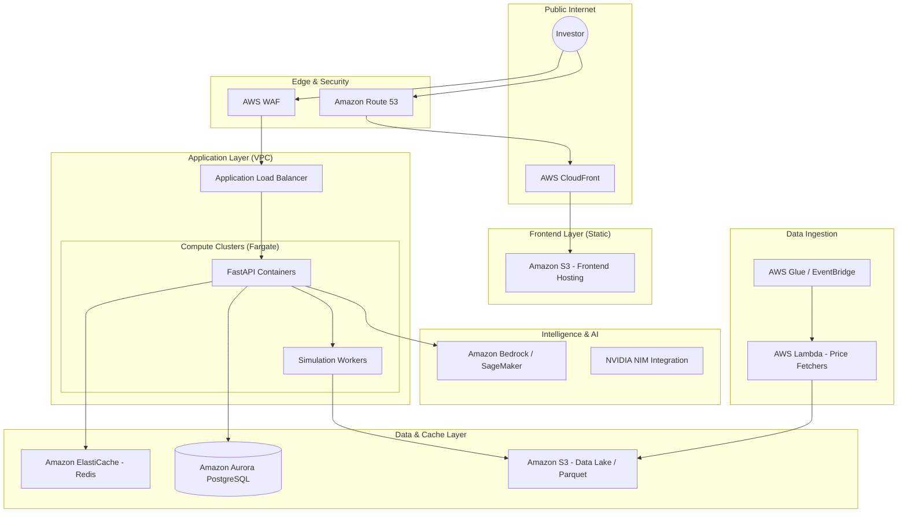

# Enterprise Architecture: Compass (AWS-First Strategy)

This document outlines the **Enterprise-Grade** target state for Project Compass. While the current prototype is a modular FastAPI/React application, this architecture is designed for multi-region scalability, high availability, and institutional security standards.

---

## 1. High-Level Architecture Diagram

---

## 2. Layer-by-Layer Breakdown

### A. Presentation Layer (Global Delivery)
*   **AWS CloudFront & S3**: The React frontend is hosted as a static site on S3 and distributed globally via CloudFront. This ensures sub-100ms latency for users worldwide and offloads all traffic from the application servers.
*   **AWS WAF (Web Application Firewall)**: Protects the API against common web exploits (SQLi, XSS) and DDoS attacks.

### B. Logic & Compute Layer (Elastic Scaling)
*   **Amazon ECS (Fargate)**: The FastAPI backend runs in serverless containers. This removes the need to manage EC2 instances while providing auto-scaling capabilities—automatically spinning up more containers during market hours and scaling down at night.
*   **Asynchronous Processing**: Heavy Monte Carlo simulations are offloaded to **Simulation Workers** (via Amazon SQS). This ensures the UI remains responsive while the heavy math is performed in the background.

### C. Data & Storage Layer (Persistence & Speed)
*   **Amazon Aurora (PostgreSQL)**: A managed relational database for user profiles, portfolio configurations, and historical performance logs. Aurora provides 3x the performance of standard PostgreSQL with global replication.
*   **Amazon ElastiCache (Redis)**: Used for sub-millisecond price lookups and simulation result caching, significantly reducing compute costs for repeat requests.
*   **Amazon S3 (Data Lake)**: Stores historical market data in **Apache Parquet** format. Parquet allows for high-speed, cost-effective analytical queries (using Amazon Athena).

### D. Intelligence Layer (AI-Driven Insights)
*   **Amazon Bedrock**: For production, Compass leverages Bedrock to access Llama 3 models in a secure, compliant environment. This ensures that sensitive financial data never leaves the AWS perimeter.
*   **SageMaker Integration**: For custom-trained financial models or hosting NVIDIA NIM containers directly on AWS hardware.

---

## 3. Management Rationale: "Why This Build?"

### 🚀 Scalability
The system is designed to handle **1,000 to 1,000,000+ portfolios** without architectural changes. By using serverless components (Fargate, S3, Lambda), the infrastructure grows and shrinks with user demand.

### 🔒 Security & Compliance
*   **Data Encryption**: All data is encrypted at rest (AES-256 via AWS KMS) and in transit (TLS 1.3).
*   **Identity Management**: Integration with **Amazon Cognito** or Enterprise SSO (Okta/Azure AD) for secure user authentication.
*   **Auditability**: **AWS CloudTrail** and **CloudWatch** provide a full audit log of every system action, essential for financial regulatory compliance.

### 💰 Cost Optimization
*   **Pay-as-you-go**: By using Fargate and Lambda, we only pay for the exact CPU/Memory used during active simulations.
*   **Intelligent Caching**: Redis reduces expensive LLM and Compute calls by over 70% for repeat user sessions.

---

## 4. Implementation Roadmap (Phase 2)

1.  **Containerization**: Wrap existing FastAPI code into Docker images.
2.  **IaC (Infrastructure as Code)**: Use **AWS CDK** or **Terraform** to provision the entire stack in minutes.
3.  **CI/CD**: Implement **AWS CodePipeline** for automated testing and deployment.
