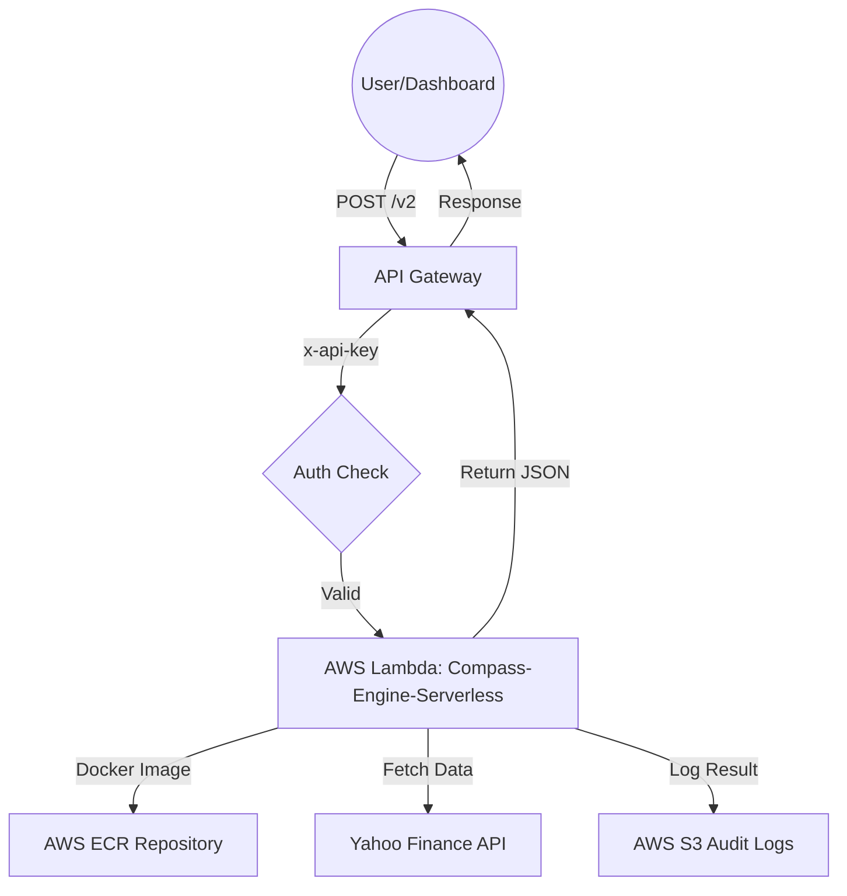

# Project Compass: Pure-Lambda Engine Documentation

## 1. System Architecture (Serverless)

Project Compass has been migrated from a SageMaker-based inference pipeline to a **Native Containerized Lambda Architecture**. This transition optimizes for high concurrency (20,000+ users), low latency (~3s responses), and near-zero operational cost.

### Infrastructure Diagram



### Component Details

- **API Gateway**: Handles CORS, SSL, and API Key validation.
- **AWS Lambda**: 3008 MB RAM / 29s Timeout. Runs the Dockerized Python engine.
- **Docker Container**: Based on `python:3.12-slim`, pre-loaded with `NumPy`, `Pandas`, and `yfinance`.
- **Compute Model**: Vectorized parallel processing (SIMD) on high-performance AWS CPU cores.

---

## 2. API Specification (v2)

The v2 endpoint is a drop-in, high-speed replacement for the original SageMaker bridge.

- **Endpoint:** `https://35w41kobie.execute-api.ap-south-1.amazonaws.com/default/v2`
- **Method:** `POST`
- **Authentication:** `x-api-key` header required.

### Request Body

| Field            | Type      | Description                                               |
| :--------------- | :-------- | :-------------------------------------------------------- |
| `portfolio_id`   | `string`  | Unique identifier for tracking.                           |
| `holdings`       | `array`   | List of assets: `{"symbol": "TICKER.NS", "quantity": 10}` |
| `num_sims`       | `integer` | Number of paths (Default: 2000, Max: 5000).               |
| `horizon_months` | `integer` | Simulation length (Default: 60).                          |

### Response Schema (JSON)

```json
{
  "portfolio_id": "string",
  "current_value": 0.0,
  "scenarios": {
    "optimistic": { "label": "Optimistic", "monthly_values": [...], "terminal_value": 0.0, "cagr_pct": 0.0 },
    "expected": { "label": "Expected", "monthly_values": [...], "terminal_value": 0.0, "cagr_pct": 0.0 },
    "pessimistic": { "label": "Pessimistic", "monthly_values": [...], "terminal_value": 0.0, "cagr_pct": 0.0 }
  },
  "probability_scores": {
    "probability_of_profit": 0.0,
    "probability_of_doubling": 0.0,
    "var_drawdown_pct": 0.0,
    "simulation_count": 2000
  }
}
```

---

## 3. Core Engine Logic

### Resilient Data Fetching

The engine implements a **Resilient Retry Strategy** for market data:

1.  Attempts 2 years of historical data.
2.  If failed, retries with 1 year, then 6 months.
3.  Uses `auto_adjust=True` for accurate split/dividend adjusted prices.

### Vectorized Monte Carlo Simulation

The math uses **Multivariate Geometric Brownian Motion (GBM)** with Student-t distributions to capture "Fat Tails" (market crashes).

- **Cholesky Decomposition**: Captures correlations between stocks (e.g., if Nifty 50 falls, how does Reliance behave?).
- **NumPy Matrix Math**: Processes all 2,000 simulations simultaneously across 1,260 trading days in a single CPU operation.

---

## 4. Performance & Scaling

| Metric                    | Value                                           |
| :------------------------ | :---------------------------------------------- |
| **Typical Response Time** | 2.5s - 4.5s                                     |
| **Concurrency Limit**     | 1,000 concurrent executions (Default AWS Limit) |
| **Throughput**            | ~20,000 simulations per minute                  |
| **Cost**                  | Free Tier (first 1M requests/month)             |

---

_Generated by Antigravity AI Engine_
